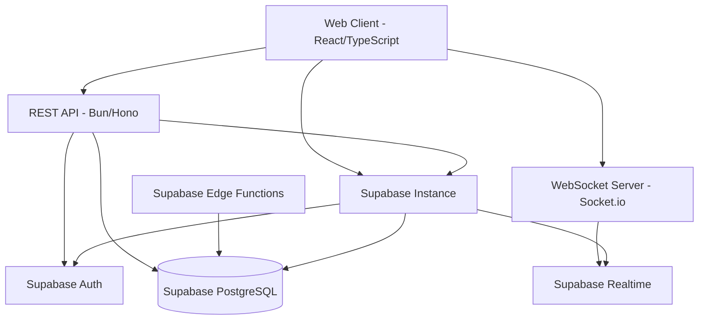

# Design Document

## Overview

The Tarkov Casino Website is a web-based gaming platform that provides casino-style entertainment with Escape from Tarkov theming. The system uses a modern web architecture with real-time capabilities for interactive gaming experiences, virtual currency management, and user engagement tracking.

## Architecture

### Navigation Structure

The application features a simplified navigation structure:
- **Home**: Landing page with game selection
- **Roulette**: Roulette game page
- **Blackjack**: Blackjack game page  
- **Profile**: User profile with statistics, history, and leaderboards
- **Login/Register**: Authentication pages

**Removed Pages:**
- Features page (removed to simplify navigation)
- Standalone leaderboards page (integrated into profile)
- Game tutorials (removed from all games)
- Game replay functionality (removed from history)

### High-Level Architecture



### Technology Stack

**Frontend:**
- React 18 with TypeScript for type safety
- Tailwind CSS for styling with custom Tarkov theme
- Framer Motion for animations and game effects
- Socket.io-client for real-time game updates
- React Query for state management and API caching

**Backend:**
- Bun runtime with Hono framework for high performance
- TypeScript for type safety across the stack
- Socket.io for real-time WebSocket communication
- Supabase Auth for authentication and session management
- Supabase client for database operations

**Database:**
- Supabase (PostgreSQL) for persistent data storage and auth
- Supabase Realtime for real-time game state updates
- Supabase Edge Functions for game logic processing

**Infrastructure:**
- Docker containers optimized for Coolify deployment
- Single dockerfile with multi-stage builds
- Environment-based configuration for local Supabase
- Coolify-compatible deployment configuration

## Components and Interfaces

### Frontend Components

#### Core Layout Components
- `AppLayout`: Main application wrapper with navigation and theming
- `Navigation`: Simplified Tarkov-themed navigation bar with user balance display (no features page)
- `GameLayout`: Shared layout for all casino games
- `LoadingScreen`: Tarkov-themed loading animations

#### Game Components
- `RouletteGame`: Interactive roulette wheel with betting interface (no tutorials)
- `BlackjackGame`: Card game interface with player actions (no tutorials)
- `BettingPanel`: Reusable betting controls for all games
- `GameHistory`: Display of recent game results (without replay functionality)

#### User Interface Components
- `UserProfile`: Account management, statistics, and integrated leaderboards
- `CurrencyDisplay`: Tarkov-themed currency formatting
- `GameStats`: Charts and analytics for player performance
- `Leaderboard`: Player rankings and competitive statistics integrated into profile page
- `AuthForms`: Login and registration components

### Backend Services

#### Authentication Service (Supabase Auth)
```typescript
interface AuthService {
  // Uses Supabase Auth client
  signUp(email: string, password: string, username: string): Promise<AuthResponse>
  signIn(email: string, password: string): Promise<AuthResponse>
  signOut(): Promise<void>
  getUser(): Promise<User | null>
  resetPassword(email: string): Promise<void>
}
```

#### Game Engine Service
```typescript
interface GameEngine {
  playRoulette(bet: RouletteBet): Promise<RouletteResult>
  playBlackjack(action: BlackjackAction): Promise<BlackjackState>
  validateBet(userId: string, amount: number): Promise<boolean>
}
```

#### Currency Service (Supabase Integration)
```typescript
interface CurrencyService {
  getBalance(userId: string): Promise<number>
  deductBalance(userId: string, amount: number): Promise<void>
  addBalance(userId: string, amount: number): Promise<void>
  getDailyBonus(userId: string): Promise<number>
  // Uses Supabase RPC functions for atomic transactions
  processGameTransaction(userId: string, betAmount: number, winAmount: number): Promise<void>
}
```

### API Endpoints

#### Authentication Endpoints
- `POST /api/auth/register` - User registration
- `POST /api/auth/login` - User login
- `POST /api/auth/logout` - User logout
- `POST /api/auth/reset-password` - Password reset

#### Game Endpoints
- `POST /api/games/roulette/bet` - Place roulette bet
- `POST /api/games/blackjack/start` - Start blackjack hand
- `POST /api/games/blackjack/action` - Player action (hit/stand/etc)

#### User Endpoints
- `GET /api/user/profile` - Get user profile
- `GET /api/user/balance` - Get current balance
- `GET /api/user/history` - Get game history
- `GET /api/user/stats` - Get user statistics
- `GET /api/user/leaderboard` - Get leaderboard data for profile page

### WebSocket Events

#### Client to Server
- `join-game`: Join a specific game room
- `place-bet`: Real-time bet placement
- `game-action`: Player actions during games

#### Server to Client
- `game-update`: Real-time game state updates
- `balance-update`: Currency balance changes
- `game-result`: Final game outcomes

## Data Models

### User Model
```typescript
interface User {
  id: string
  username: string
  email: string
  passwordHash: string
  balance: number
  createdAt: Date
  lastLogin: Date
  isActive: boolean
}
```

### Game History Model
```typescript
interface GameHistory {
  id: string
  userId: string
  gameType: 'roulette' | 'blackjack'
  betAmount: number
  result: number
  winAmount: number
  gameData: object // Game-specific data
  timestamp: Date
}
```

### Game State Models
```typescript
interface RouletteState {
  betAmount: number
  betType: string
  winningNumber: number
  multiplier: number
}

interface BlackjackState {
  playerHand: Card[]
  dealerHand: Card[]
  playerValue: number
  dealerValue: number
  gameStatus: 'playing' | 'won' | 'lost' | 'push'
}
```

## Error Handling

### Client-Side Error Handling
- Global error boundary for React components
- Toast notifications for user-friendly error messages
- Retry mechanisms for failed API calls
- Graceful degradation for WebSocket disconnections

### Server-Side Error Handling
- Centralized error middleware for Express
- Structured error responses with error codes
- Logging system for debugging and monitoring
- Input validation and sanitization

### Game-Specific Error Handling
- Insufficient balance validation
- Invalid bet amount checks
- Game state consistency verification
- Network disconnection recovery

## Testing Strategy

### Frontend Testing
- **Unit Tests**: Jest and React Testing Library for component testing
- **Integration Tests**: Testing user flows and API interactions
- **E2E Tests**: Playwright for full application testing
- **Visual Tests**: Screenshot testing for UI consistency

### Backend Testing
- **Unit Tests**: Jest for service and utility function testing
- **Integration Tests**: Supertest for API endpoint testing
- **Database Tests**: Test database with seed data
- **Game Logic Tests**: Comprehensive testing of game algorithms

### Game Fairness Testing
- **Random Number Generation**: Testing RNG algorithms for fairness
- **Payout Verification**: Ensuring correct odds and payouts
- **Edge Case Testing**: Testing boundary conditions and edge cases
- **Performance Testing**: Load testing for concurrent users

### Security Testing
- **Authentication Testing**: JWT token validation and expiration
- **Input Validation**: SQL injection and XSS prevention
- **Rate Limiting**: API abuse prevention
- **Session Security**: Secure session management

## Performance Considerations

### Frontend Optimization
- Code splitting for game components
- Image optimization for Tarkov assets
- Lazy loading for non-critical components
- Efficient state management with React Query

### Backend Optimization
- Database indexing for frequently queried data
- Redis caching for session and game state
- Connection pooling for database connections
- Rate limiting to prevent abuse

### Real-Time Performance
- WebSocket connection management
- Efficient game state synchronization
- Minimal data transfer for real-time updates
- Graceful handling of connection issues

## Deployment Configuration (Coolify)

### Docker Configuration
- **Multi-stage Dockerfile**: Optimized for Bun runtime with minimal production image
- **Environment Variables**: Configured for local Supabase connection
- **Port Configuration**: Single port exposure for Coolify compatibility
- **Health Checks**: Built-in health endpoints for Coolify monitoring

### Coolify Deployment Structure
```dockerfile
# Dockerfile optimized for Coolify
FROM oven/bun:1 as base
WORKDIR /app

# Install dependencies
COPY package.json bun.lockb ./
RUN bun install --frozen-lockfile

# Build application
COPY . .
RUN bun run build

# Production stage
FROM oven/bun:1-slim
WORKDIR /app
COPY --from=base /app/dist ./dist
COPY --from=base /app/node_modules ./node_modules
COPY package.json ./

EXPOSE 3000
CMD ["bun", "run", "start"]
```

### Environment Configuration
```env
# Supabase Configuration (Local)
SUPABASE_URL=http://localhost:54321
SUPABASE_ANON_KEY=your_local_anon_key
SUPABASE_SERVICE_ROLE_KEY=your_local_service_key

# Application Configuration
PORT=3000
NODE_ENV=production
JWT_SECRET=your_jwt_secret

# Game Configuration
STARTING_BALANCE=10000
DAILY_BONUS=1000
```

### Coolify Service Configuration
- **Build Pack**: Docker
- **Port**: 3000
- **Health Check**: `/api/health`
- **Environment**: Production
- **Restart Policy**: Always

## Security Measures

### Authentication Security (Supabase Auth)
- Supabase Auth handles JWT tokens and session management
- Row Level Security (RLS) policies for data protection
- Rate limiting on authentication endpoints
- Built-in account verification and password reset

### Game Security
- Server-side validation of all game actions
- Cryptographically secure random number generation using Bun's crypto API
- Prevention of client-side game manipulation
- Audit logging for all game transactions via Supabase

### Data Protection
- Supabase RLS policies for user data isolation
- Input sanitization and validation
- Built-in SQL injection prevention with Supabase client
- XSS protection with proper output encoding
- HTTPS enforcement for all communications