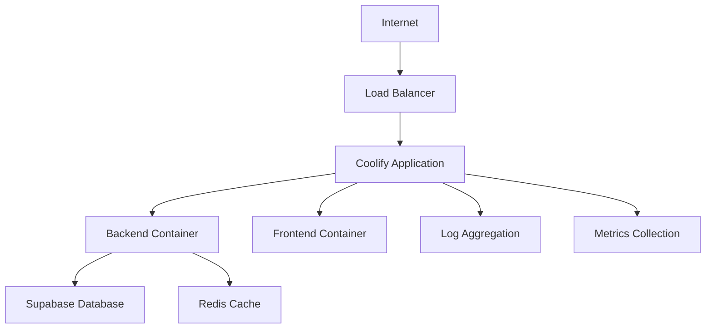

# Deployment and Maintenance Guide

## Overview

This guide covers deployment procedures, maintenance tasks, and operational procedures for the Tarkov Casino website. The application is designed for deployment on Coolify with Docker containers and uses Supabase for database services.

## Table of Contents

1. [Deployment Architecture](#deployment-architecture)
2. [Environment Setup](#environment-setup)
3. [Deployment Procedures](#deployment-procedures)
4. [Maintenance Tasks](#maintenance-tasks)
5. [Monitoring and Logging](#monitoring-and-logging)
6. [Troubleshooting](#troubleshooting)
7. [Security Procedures](#security-procedures)

## Deployment Architecture

### Infrastructure Overview



### Technology Stack

- **Container Platform**: Docker with Coolify orchestration
- **Backend**: Bun runtime with Hono framework
- **Frontend**: React with Vite build system
- **Database**: Supabase (PostgreSQL)
- **Caching**: Redis (optional)
- **Monitoring**: Built-in health checks and logging

## Environment Setup

### Development Environment

#### Prerequisites
```bash
# Install required tools
curl -fsSL https://bun.sh/install | bash  # Bun runtime
npm install -g @supabase/cli               # Supabase CLI
docker --version                           # Docker
git --version                             # Git
```

#### Local Development Setup
```bash
# Clone repository
git clone <repository-url>
cd tarkov-casino-website

# Install dependencies
cd packages/backend && bun install
cd ../frontend && npm install

# Setup environment variables
cp packages/backend/.env.example packages/backend/.env
cp packages/frontend/.env.example packages/frontend/.env

# Start local Supabase
supabase start

# Run database migrations
cd packages/backend
bun run db:migrate

# Start development servers
bun run dev  # Backend on port 3000
cd ../frontend && npm run dev  # Frontend on port 5173
```

### Production Environment

#### Environment Variables

**Backend (.env)**
```bash
# Database Configuration
SUPABASE_URL=https://your-project.supabase.co
SUPABASE_ANON_KEY=your_anon_key
SUPABASE_SERVICE_ROLE_KEY=your_service_role_key

# Application Configuration
NODE_ENV=production
PORT=3000
CORS_ORIGIN=https://your-domain.com

# Security
JWT_SECRET=your_jwt_secret_here
RATE_LIMIT_WINDOW_MS=900000
RATE_LIMIT_MAX_REQUESTS=100

# Game Configuration
STARTING_BALANCE=10000
DAILY_BONUS=1000
MAX_BET_AMOUNT=1000

# Monitoring
LOG_LEVEL=info
HEALTH_CHECK_INTERVAL=30000
```

**Frontend (.env.production)**
```bash
# API Configuration
VITE_API_URL=https://api.your-domain.com
VITE_SUPABASE_URL=https://your-project.supabase.co
VITE_SUPABASE_ANON_KEY=your_anon_key

# Application Configuration
VITE_APP_NAME=Tarkov Casino
VITE_APP_VERSION=1.0.0
VITE_ENVIRONMENT=production

# Analytics (optional)
VITE_ANALYTICS_ID=your_analytics_id
```

## Deployment Procedures

### 1. Pre-Deployment Checklist

#### Code Quality Checks
```bash
# Run all tests
cd packages/backend && bun test
cd packages/frontend && npm run test

# Run linting
cd packages/frontend && npm run lint

# Type checking
cd packages/frontend && npm run type-check

# Security audit
cd packages/backend && bun audit
cd packages/frontend && npm audit
```

#### Database Preparation
```bash
# Backup current database
./scripts/backup-database.sh

# Test migrations on staging
cd packages/backend
bun run db:migrate:staging

# Verify data integrity
bun run db:verify
```

### 2. Coolify Deployment

#### Initial Setup

1. **Create Coolify Application**
   ```bash
   # In Coolify dashboard:
   # 1. Create new application
   # 2. Connect to Git repository
   # 3. Set build pack to Docker
   # 4. Configure environment variables
   ```

2. **Configure Build Settings**
   ```dockerfile
   # Dockerfile is already configured for Coolify
   # Build command: docker build -t tarkov-casino .
   # Start command: bun run start
   # Port: 3000
   ```

3. **Set Environment Variables**
   ```bash
   # In Coolify dashboard, add all production environment variables
   # Ensure sensitive values are properly secured
   ```

#### Deployment Process

```bash
# 1. Push to main branch triggers automatic deployment
git push origin main

# 2. Monitor deployment in Coolify dashboard
# 3. Check application logs for any issues
# 4. Verify health check endpoint responds
curl https://your-domain.com/api/health

# 5. Run post-deployment verification
./scripts/verify-deployment.sh
```

### 3. Manual Deployment

#### Build and Deploy Script
```bash
#!/bin/bash
# scripts/deploy.sh

set -e

echo "Starting deployment process..."

# Build application
echo "Building application..."
docker build -t tarkov-casino:latest .

# Tag for registry
docker tag tarkov-casino:latest your-registry/tarkov-casino:latest

# Push to registry
echo "Pushing to registry..."
docker push your-registry/tarkov-casino:latest

# Deploy to Coolify (via API or manual)
echo "Deploying to Coolify..."
# Coolify deployment commands here

echo "Deployment completed successfully!"
```

### 4. Database Migrations

#### Migration Process
```bash
#!/bin/bash
# scripts/migrate-database.sh

set -e

echo "Starting database migration..."

# Backup before migration
./scripts/backup-database.sh

# Run migrations
cd packages/backend
bun run db:migrate:production

# Verify migration success
bun run db:verify

echo "Database migration completed!"
```

#### Rollback Procedure
```bash
#!/bin/bash
# scripts/rollback-migration.sh

set -e

BACKUP_FILE="$1"

if [ -z "$BACKUP_FILE" ]; then
    echo "Usage: $0 <backup_file>"
    exit 1
fi

echo "Rolling back database to $BACKUP_FILE..."

# Restore from backup
./scripts/restore-database.sh "$BACKUP_FILE"

# Verify rollback
cd packages/backend
bun run db:verify

echo "Database rollback completed!"
```

## Maintenance Tasks

### 1. Regular Maintenance Schedule

#### Daily Tasks
- Monitor application health and performance
- Check error logs for issues
- Verify backup completion
- Monitor disk space and resource usage

#### Weekly Tasks
- Review security logs
- Update dependencies (if needed)
- Performance analysis
- Database maintenance

#### Monthly Tasks
- Security updates
- Backup restoration testing
- Performance optimization
- Documentation updates

### 2. Database Maintenance

#### Routine Database Tasks
```sql
-- Database maintenance queries
-- Run monthly during low-traffic periods

-- Update table statistics
ANALYZE;

-- Rebuild indexes if needed
REINDEX DATABASE tarkov_casino;

-- Clean up old audit logs (older than 90 days)
DELETE FROM audit_logs 
WHERE created_at < NOW() - INTERVAL '90 days';

-- Vacuum tables to reclaim space
VACUUM ANALYZE;
```

#### Performance Monitoring
```bash
#!/bin/bash
# scripts/db-performance-check.sh

# Check slow queries
psql "$SUPABASE_DB_URL" -c "
SELECT query, mean_time, calls, total_time
FROM pg_stat_statements
ORDER BY mean_time DESC
LIMIT 10;"

# Check table sizes
psql "$SUPABASE_DB_URL" -c "
SELECT schemaname, tablename, 
       pg_size_pretty(pg_total_relation_size(schemaname||'.'||tablename)) as size
FROM pg_tables
WHERE schemaname = 'public'
ORDER BY pg_total_relation_size(schemaname||'.'||tablename) DESC;"

# Check index usage
psql "$SUPABASE_DB_URL" -c "
SELECT schemaname, tablename, indexname, idx_scan, idx_tup_read, idx_tup_fetch
FROM pg_stat_user_indexes
ORDER BY idx_scan DESC;"
```

### 3. Application Maintenance

#### Log Rotation
```bash
#!/bin/bash
# scripts/rotate-logs.sh

LOG_DIR="/var/log/tarkov-casino"
RETENTION_DAYS=30

# Rotate application logs
find "$LOG_DIR" -name "*.log" -mtime +$RETENTION_DAYS -delete

# Compress recent logs
find "$LOG_DIR" -name "*.log" -mtime +7 -exec gzip {} \;

echo "Log rotation completed"
```

#### Cache Maintenance
```bash
#!/bin/bash
# scripts/cache-maintenance.sh

# Clear expired cache entries
redis-cli EVAL "
local keys = redis.call('keys', ARGV[1])
for i=1,#keys,5000 do
    redis.call('del', unpack(keys, i, math.min(i+4999, #keys)))
end
return #keys
" 0 "cache:*"

echo "Cache maintenance completed"
```

### 4. Security Maintenance

#### Security Updates
```bash
#!/bin/bash
# scripts/security-update.sh

set -e

echo "Checking for security updates..."

# Update system packages
sudo apt update && sudo apt upgrade -y

# Update Node.js dependencies
cd packages/frontend
npm audit fix

# Update Bun dependencies
cd ../backend
bun update

# Rebuild and redeploy if updates were applied
if [ "$UPDATES_APPLIED" = "true" ]; then
    echo "Security updates applied, rebuilding..."
    ./scripts/deploy.sh
fi

echo "Security update check completed"
```

#### SSL Certificate Renewal
```bash
#!/bin/bash
# scripts/renew-ssl.sh

# Coolify typically handles SSL automatically
# This script is for manual certificate management if needed

echo "Checking SSL certificate expiration..."

# Check certificate expiration
openssl s_client -connect your-domain.com:443 -servername your-domain.com < /dev/null 2>/dev/null | \
openssl x509 -noout -dates

# Renew if needed (Let's Encrypt example)
if [ "$CERT_EXPIRES_SOON" = "true" ]; then
    certbot renew --nginx
    systemctl reload nginx
fi

echo "SSL certificate check completed"
```

## Monitoring and Logging

### 1. Health Monitoring

#### Health Check Endpoint
```typescript
// Backend health check implementation
app.get('/api/health', async (c) => {
  const health = {
    status: 'healthy',
    timestamp: new Date().toISOString(),
    version: process.env.APP_VERSION || '1.0.0',
    uptime: process.uptime(),
    database: 'unknown',
    memory: process.memoryUsage(),
  };

  try {
    // Check database connection
    await supabase.from('user_profiles').select('count').limit(1);
    health.database = 'connected';
  } catch (error) {
    health.database = 'disconnected';
    health.status = 'unhealthy';
  }

  const statusCode = health.status === 'healthy' ? 200 : 503;
  return c.json(health, statusCode);
});
```

#### Monitoring Script
```bash
#!/bin/bash
# scripts/monitor-health.sh

HEALTH_URL="https://your-domain.com/api/health"
ALERT_EMAIL="admin@example.com"

# Check health endpoint
RESPONSE=$(curl -s -w "%{http_code}" "$HEALTH_URL")
HTTP_CODE="${RESPONSE: -3}"
BODY="${RESPONSE%???}"

if [ "$HTTP_CODE" != "200" ]; then
    echo "Health check failed: HTTP $HTTP_CODE" | mail -s "Health Alert" "$ALERT_EMAIL"
    exit 1
fi

# Parse response and check database
if ! echo "$BODY" | jq -e '.database == "connected"' > /dev/null; then
    echo "Database connection failed" | mail -s "Database Alert" "$ALERT_EMAIL"
    exit 1
fi

echo "Health check passed"
```

### 2. Application Logging

#### Log Configuration
```typescript
// Backend logging setup
import { logger } from './middleware/logger';

const logLevel = process.env.LOG_LEVEL || 'info';
const logFormat = process.env.NODE_ENV === 'production' ? 'json' : 'pretty';

export const appLogger = logger({
  level: logLevel,
  format: logFormat,
  destination: process.env.LOG_FILE || './logs/app.log'
});
```

#### Log Analysis
```bash
#!/bin/bash
# scripts/analyze-logs.sh

LOG_FILE="/var/log/tarkov-casino/app.log"
REPORT_FILE="/tmp/log-analysis-$(date +%Y%m%d).txt"

echo "Log Analysis Report - $(date)" > "$REPORT_FILE"
echo "=================================" >> "$REPORT_FILE"

# Error count by type
echo "Error Summary:" >> "$REPORT_FILE"
grep -i error "$LOG_FILE" | awk '{print $4}' | sort | uniq -c | sort -nr >> "$REPORT_FILE"

# Top IP addresses
echo -e "\nTop IP Addresses:" >> "$REPORT_FILE"
grep -o '[0-9]\{1,3\}\.[0-9]\{1,3\}\.[0-9]\{1,3\}\.[0-9]\{1,3\}' "$LOG_FILE" | sort | uniq -c | sort -nr | head -10 >> "$REPORT_FILE"

# Response time analysis
echo -e "\nResponse Time Analysis:" >> "$REPORT_FILE"
grep "response_time" "$LOG_FILE" | awk '{print $6}' | sort -n | awk '
{
    times[NR] = $1
    sum += $1
}
END {
    if (NR > 0) {
        print "Average: " sum/NR "ms"
        print "Median: " times[int(NR/2)] "ms"
        print "95th percentile: " times[int(NR*0.95)] "ms"
    }
}' >> "$REPORT_FILE"

echo "Log analysis completed: $REPORT_FILE"
```

### 3. Performance Monitoring

#### Resource Monitoring
```bash
#!/bin/bash
# scripts/monitor-resources.sh

# CPU usage
CPU_USAGE=$(top -bn1 | grep "Cpu(s)" | awk '{print $2}' | awk -F'%' '{print $1}')

# Memory usage
MEMORY_USAGE=$(free | grep Mem | awk '{printf("%.2f", $3/$2 * 100.0)}')

# Disk usage
DISK_USAGE=$(df -h / | awk 'NR==2 {print $5}' | sed 's/%//')

# Database connections
DB_CONNECTIONS=$(psql "$SUPABASE_DB_URL" -t -c "SELECT count(*) FROM pg_stat_activity;")

echo "Resource Usage Report - $(date)"
echo "CPU Usage: ${CPU_USAGE}%"
echo "Memory Usage: ${MEMORY_USAGE}%"
echo "Disk Usage: ${DISK_USAGE}%"
echo "DB Connections: $DB_CONNECTIONS"

# Alert if usage is high
if (( $(echo "$CPU_USAGE > 80" | bc -l) )); then
    echo "HIGH CPU USAGE ALERT: ${CPU_USAGE}%" | mail -s "Resource Alert" "$ALERT_EMAIL"
fi

if (( $(echo "$MEMORY_USAGE > 85" | bc -l) )); then
    echo "HIGH MEMORY USAGE ALERT: ${MEMORY_USAGE}%" | mail -s "Resource Alert" "$ALERT_EMAIL"
fi
```

## Troubleshooting

### 1. Common Issues

#### Application Won't Start
```bash
# Check logs
docker logs <container_id>

# Check environment variables
env | grep -E "(SUPABASE|NODE_ENV|PORT)"

# Test database connection
psql "$SUPABASE_DB_URL" -c "SELECT 1;"

# Check port availability
netstat -tulpn | grep :3000
```

#### Database Connection Issues
```bash
# Test connection
pg_isready -d "$SUPABASE_DB_URL"

# Check connection pool
psql "$SUPABASE_DB_URL" -c "
SELECT state, count(*) 
FROM pg_stat_activity 
GROUP BY state;"

# Reset connections if needed
psql "$SUPABASE_DB_URL" -c "
SELECT pg_terminate_backend(pid) 
FROM pg_stat_activity 
WHERE state = 'idle' 
AND state_change < now() - interval '1 hour';"
```

#### High Memory Usage
```bash
# Check memory usage by process
ps aux --sort=-%mem | head -10

# Check for memory leaks
valgrind --tool=memcheck --leak-check=full node app.js

# Restart application if needed
docker restart <container_id>
```

### 2. Emergency Procedures

#### Application Rollback
```bash
#!/bin/bash
# scripts/emergency-rollback.sh

set -e

PREVIOUS_VERSION="$1"

if [ -z "$PREVIOUS_VERSION" ]; then
    echo "Usage: $0 <previous_version_tag>"
    exit 1
fi

echo "EMERGENCY ROLLBACK to $PREVIOUS_VERSION"

# Pull previous version
docker pull your-registry/tarkov-casino:$PREVIOUS_VERSION

# Stop current version
docker stop tarkov-casino-current

# Start previous version
docker run -d --name tarkov-casino-rollback \
    --env-file .env.production \
    -p 3000:3000 \
    your-registry/tarkov-casino:$PREVIOUS_VERSION

# Verify rollback
sleep 10
curl -f https://your-domain.com/api/health

echo "Emergency rollback completed"
```

#### Database Emergency Recovery
```bash
#!/bin/bash
# scripts/emergency-db-recovery.sh

set -e

echo "EMERGENCY DATABASE RECOVERY"

# Find latest backup
LATEST_BACKUP=$(find /backups/tarkov-casino -name "*.sql.gz" -type f -printf '%T@ %p\n' | sort -n | tail -1 | cut -d' ' -f2-)

echo "Using backup: $LATEST_BACKUP"

# Restore database
./scripts/restore-database.sh "$LATEST_BACKUP"

# Verify recovery
cd packages/backend
bun run db:verify

echo "Emergency database recovery completed"
```

## Security Procedures

### 1. Security Monitoring

#### Security Audit Script
```bash
#!/bin/bash
# scripts/security-audit.sh

echo "Security Audit Report - $(date)"
echo "================================"

# Check for failed login attempts
echo "Failed Login Attempts (last 24h):"
grep "authentication failed" /var/log/tarkov-casino/app.log | \
    grep "$(date -d '1 day ago' '+%Y-%m-%d')" | wc -l

# Check for suspicious activity
echo "Suspicious Activity:"
grep -E "(injection|xss|csrf)" /var/log/tarkov-casino/app.log | tail -10

# Check SSL certificate
echo "SSL Certificate Status:"
openssl s_client -connect your-domain.com:443 -servername your-domain.com < /dev/null 2>/dev/null | \
openssl x509 -noout -dates

# Check for outdated dependencies
echo "Dependency Security Check:"
cd packages/frontend && npm audit --audit-level=high
cd ../backend && bun audit
```

### 2. Incident Response

#### Security Incident Procedure
1. **Immediate Response**
   - Isolate affected systems
   - Preserve evidence
   - Notify security team

2. **Assessment**
   - Determine scope of incident
   - Identify compromised data
   - Document timeline

3. **Containment**
   - Stop ongoing attack
   - Patch vulnerabilities
   - Reset compromised credentials

4. **Recovery**
   - Restore from clean backups
   - Verify system integrity
   - Monitor for reoccurrence

5. **Post-Incident**
   - Document lessons learned
   - Update security procedures
   - Implement additional controls

## Contact Information

### Emergency Contacts
- **Primary On-Call**: +1-555-0123
- **Secondary On-Call**: +1-555-0124
- **Database Administrator**: dba@example.com
- **Security Team**: security@example.com

### Escalation Matrix
1. **Level 1** (0-2 hours): Development team
2. **Level 2** (2-4 hours): Senior engineers
3. **Level 3** (4+ hours): External consultants
4. **Level 4** (Critical): Management notification

---

**Important**: Keep this documentation updated as procedures change. Regular review and testing of procedures is essential for operational success.